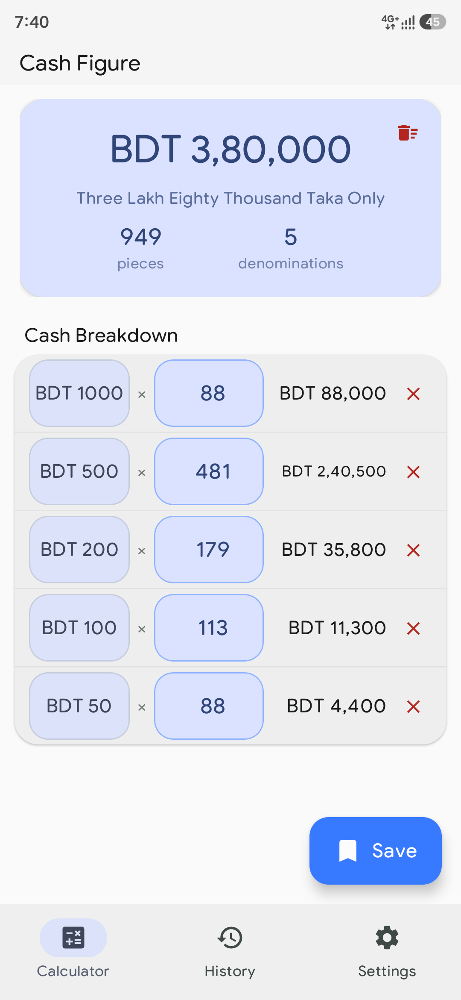
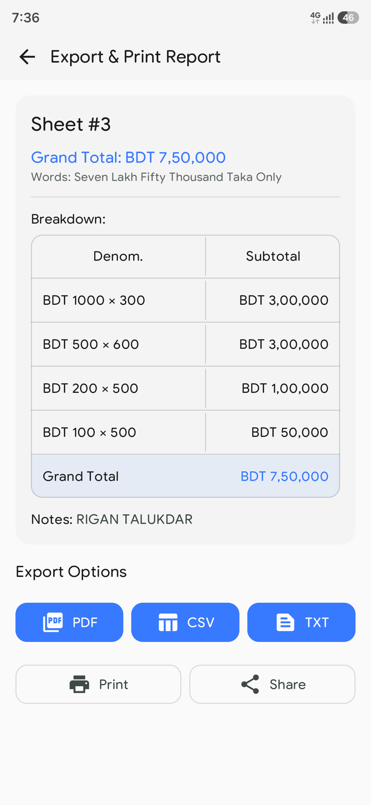
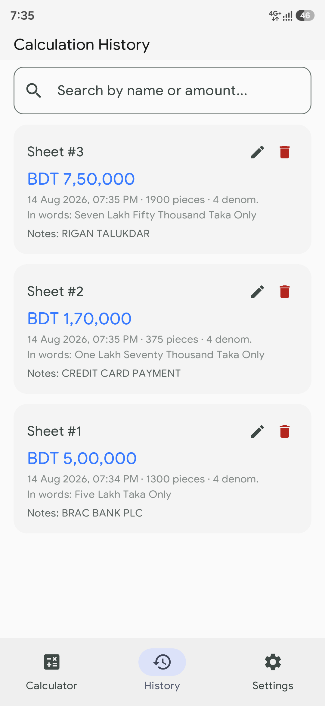
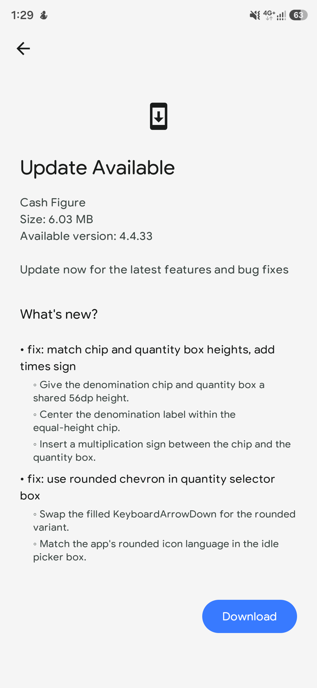
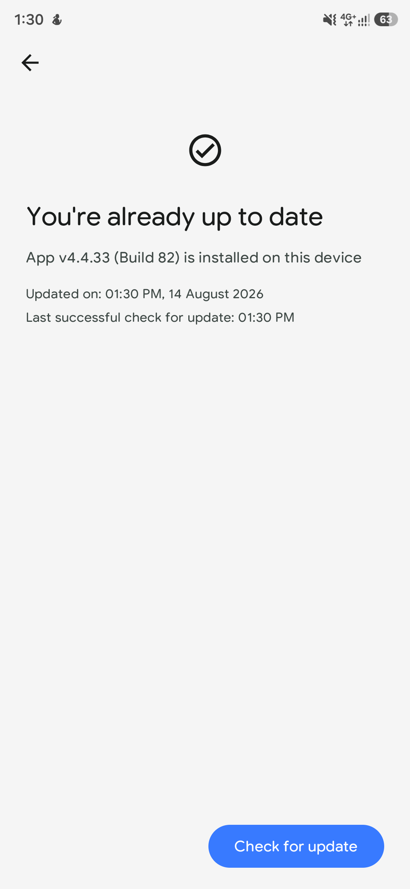

<p align="center">
  
</p>

<h1 align="center">Cash Figure App</h1>

<p align="center">
  The simple way to count money
</p>

<p align="center">
  
  
  
  
  
  
  
  
  
  
  <a href="https://github.com/tanvirr007/cash-figure-app/issues/new/choose">
    
  </a>
</p>

---

## About

Cash Figure is a production-quality Android app built specifically for counting
Bangladeshi cash (Taka). It is designed for daily use by shop owners, supermarkets,
mobile banking agents, accountants, wholesalers, and restaurants across Bangladesh.

It is **100% free, ad-free, and open source** — no ads, no tracking, no analytics,
no accounts, and no data collection. It works entirely offline, except for the
optional in-app update check.

## Download

[Download the latest APK](https://github.com/tanvirr007/cash-figure-app/releases/latest)

[Report an Issue](https://github.com/tanvirr007/cash-figure-app/issues/new/choose)

> **Note:** Since Cash Figure is not distributed through the Google Play Store,
> Google Play Protect may show a warning when you install or update the APK — it
> blocks unverified apps from outside the Play Store to prevent security risks
> like data theft or malware. This is a standard check for any app not published
> on Play, and it does not mean the app is unsafe: Cash Figure is 100% open
> source (MIT license), so anyone can audit the source code at any time. If you
> see the prompt, you can safely tap **"Install anyway"** (or **"More details" →
> "Install anyway"**).

## Screenshots

<!-- TODO: replace placeholder images in assets/screenshots/ with real screenshots -->

<p align="center">
  
  
  
  
  
</p>

<p align="center">
  Calculator &nbsp;&nbsp;&nbsp; Report &nbsp;&nbsp;&nbsp; History &nbsp;&nbsp;&nbsp; Update available &nbsp;&nbsp;&nbsp; Up to date
</p>

## Features

- **Bangladeshi Denominations** — full support for 1000, 500, 200, 100, 50, 20, 10,
  5, 2, and 1 Taka notes/coins.
- **Live Calculation** — instant row totals, grand total, total cash pieces, and
  active denomination count — no calculate button needed.
- **Amount in Words (100% Offline)** — converts grand totals to words in English
  and Bangla up to 999 Crore using the Bangladeshi Lakh/Crore numbering system.
- **Bangladeshi Currency Formatting** — native digit grouping and Bengali numerals.
- **History and Auto-Save** — every calculation is persisted to a local Room
  database with search, rename, duplicate, pin, favorite, and restore-deleted.
- **Reports and Printing** — export reports as PDF, CSV, or TXT, print via the
  native Android PrintManager, and share with one tap.
- **JSON Backup and Restore** — back up all data to JSON and restore seamlessly
  with schema-version safety.
- **In-App OTA Updates** — silent update check on launch, in-app APK download with
  live progress, and a bilingual (EN/BN) changelog.
- **Screen On Mode** — keeps the screen awake during active counting sessions.
- **App Lock** — lock the app with your fingerprint or device screen lock
  (PIN/pattern/password); enable/disable from settings (EN + Bangla).
- **No Ads** — zero advertisements, zero in-app purchases, zero paywalls.
- **Open Source** — full source under the MIT license; audit it, fork it, improve it.
- **Privacy First** — 100% offline with no analytics and no tracking. The only
  network calls are the OTA update endpoints (update manifest + changelog +
  release APK).

## Tech Stack

| Layer            | Technology                                             |
|------------------|--------------------------------------------------------|
| Language         | Kotlin (100%)                                          |
| UI               | Jetpack Compose + Material Design 3 (Teal/Amber theme) |
| Architecture     | MVVM + Clean Architecture (data / domain / ui layers)  |
| Database         | Room Database (SQLite)                                 |
| Preferences      | Jetpack DataStore                                      |
| Dependency Injection | Hilt + KSP                                         |
| Async            | Kotlin Coroutines + StateFlow / Flow                   |
| CI/CD            | GitHub Actions with Telegram release notifications     |

## Project Structure

```
app/src/main/java/app/cash/tanvir/info/
├── domain/            # Pure Kotlin models + repository interfaces (no Android deps)
├── data/              # Room DB, DataStore, repository implementations
├── di/                # Hilt modules (DatabaseModule, RepositoryModule)
├── ui/                # Single-activity Compose app
│   ├── MainActivity.kt    # Splash, app lock, FLAG_SECURE, launch OTA check
│   ├── navigation/        # NavGraph — 8 routes
│   │                      #   (Calculator, History, Report, Settings,
│   │                      #    Changelog, Update, About, Settings Detail)
│   ├── theme/             # Material 3 theme with Tiro Bangla font
│   └── screen/            # Calculator, History, Report, Settings, Changelog, Update, About, Settings Detail (+ components)
└── util/              # Pure helpers: formatters, converters, report generators
```

Data flows one way: Screen -> ViewModel -> Repository -> Room DB / DataStore.
ViewModels expose StateFlow; screens collect state. See [docs/FILES.md](docs/FILES.md)
for a complete per-file reference, and [ota.md](ota.md) for the OTA updater design.

## Getting Started

Requirements: JDK 17+ and Android Studio (Ladybug or newer).

```bash
# Clone the repository
git clone https://github.com/tanvirr007/cash-figure-app.git
cd cash-figure-app

# Build a debug APK
./gradlew assembleDebug        # on Windows: gradlew.bat assembleDebug

# Run unit tests
./gradlew test                 # on Windows: gradlew.bat test
```

The APK lands in `app/build/outputs/apk/`. Prebuilt release APKs are published on
the [Releases page](https://github.com/tanvirr007/cash-figure-app/releases) —
installable directly without Google Play.

## Data Portability

All history transactions can be exported to a JSON backup file and restored on
the same or another device. Backups are versioned inside the database schema,
so restoring data created by an older app version stays safe.

## Bangla Translation

The Bangla (বাংলা) translation of Cash Figure has been professionally revised
to read naturally — everyday Bangla, consistent wording, and no robotic,
machine-translated phrasing. The app is bilingual (English + Bangla); English
is the default and Bangla is a user choice.

If you spot a string that still feels off, **you are very welcome** to fix it —
contributions of any size help. You do not need to know Android; fixing a single
string is a perfectly good contribution.

### Settled terms

These EN/BN pairs are already fixed in the app. New translations **must reuse
them** — matching these keeps the wording consistent. When in doubt, check the
table first, then grep for `isBangla` to see the exact context.

| English | Bangla |
|---------|--------|
| Cash Figure | ক্যাশ ফিগার |
| History | ইতিহাস |
| Settings | সেটিংস |
| Calculation History | হিসাবের ইতিহাস |
| Saved Sheet | সেভ করা হিসাব |
| Sheet Name | শিটের নাম |
| Rename Sheet | শিটের নাম পরিবর্তন |
| Sheet deleted | শিটটি মুছে ফেলা হয়েছে |
| Undo | পূর্বাবস্থায় আনুন |
| Cash Breakdown | বিস্তারিত হিসাব |
| Subtotal | সাবটোটাল |
| Grand Total | সর্বমোট |
| Cash Calculation Report | ক্যাশ হিসাবের রিপোর্ট |
| Save | সেভ করুন |
| Delete | মুছে ফেলুন |
| Clear All | সব মুছুন |
| Search | খুঁজুন |
| Update | আপডেট |
| Currency | নোট |
| Version | সংস্করণ |
| Data | ডেটা |
| Restore Data | ডেটা পুনরুদ্ধার |
| Backup & Restore | ব্যাকআপ ও পুনরুদ্ধার |
| Changelog | আপডেটের ইতিহাস |
| Preview | দেখুন |
| Export & Print Report | রিপোর্ট সেভ ও প্রিন্ট |

Two rules from the translation rewrite: **নোট always means banknote** — the
remarks field (Add Notes / Notes:) is **মন্তব্য**. And keep everyday loanwords
that native speakers actually use (আপডেট, ডাউনলোড, রিপোর্ট, থিম, সেভ, ড্রাফট,
ব্যাকআপ, রিসেট, ক্যাশ) — avoid robotic ones (ডাটা, ভার্সন, রিস্টোর, প্রিভিউ).

If you believe a settled term itself is wrong, suggest the change in the PR —
but keep every other string consistent with the table.

### How to contribute (step by step)

<details>
<summary>Click to expand the in-depth guide</summary>

There are no string resources. Every UI string is inline in the Kotlin source,
written as `if (isBangla) "..." else "..."` — the Bangla text is the first
argument, the English text is the second.

**1. Find the string.** Grep for `isBangla` and open the file where the issue
is, e.g.:

```bash
grep -rn "isBangla" --include="*.kt" app/src/main/java
```

**2. Fix the Bangla text.** Look at the example below — change only the Bangla
part, never the English one, and keep the surrounding code untouched:

```kotlin
// settingsdetail/SettingsDetailScreen.kt
SettingsSection.THEME -> if (isBangla) "অ্যাপ থিম" else "App Theme"
```

A rough or unnatural translation might be improved like this:

```kotlin
SettingsSection.THEME -> if (isBangla) "অ্যাপের থিম" else "App Theme"
```

**3. Verify it builds and renders.**

```bash
./gradlew assembleDebug
```

Then install the APK and switch the app to Bangla:
**Settings > Language > বাংলা**, and open the screen you edited to confirm the
corrected string shows. Also check the English side still renders — you must
never change the English text.

If you edited Bangla text in `NumberToWordsConverter.kt` (amounts in words), the
unit tests for it must keep passing:

```bash
./gradlew test
```

**4. Submit a pull request.** Follow the repo's commit structure exactly:

```text
<type>: <short summary>

- Bullet list of what changed
- One line per change
- Explain why, not just what

TEST:
- Run ./gradlew assembleDebug and confirm the app compiles.
- <what you verified manually>

Signed-off-by: Your Name <you@example.com>
```

**The `<type>` prefix — which one do I use?**

Every commit title starts with a lowercase type followed by a colon and a space.
Pick the type that matches the *nature* of your change:

| Type       | Use it when…                                                            | Example title                          |
|------------|-------------------------------------------------------------------------|----------------------------------------|
| `fix:`     | Correcting a wrong behavior — bad translation, crash, wrong layout       | `fix: correct Bangla theme label`      |
| `feat:`    | Adding something new — a screen, a setting, a new feature                | `feat: add Bangla currency hint`       |
| `style:`   | Cosmetic only — visuals, spacing, icons; no behavior change              | `style: align settings row icons`      |
| `refactor:`| Rewriting code without changing what it does                             | `refactor: extract translation helper` |
| `docs:`    | Documentation only — README, docs/, comments                             | `docs: document translation workflow`  |
| `test:`    | Tests only — adding or updating unit tests                               | `test: cover Bangla word conversion`   |
| `release:` | Auto-generated release commits (CI only, skip this)                      | `release: OTA manifest v3.4.0`         |

For a translation fix, the answer is almost always **`fix:`**. When in doubt,
`fix:` is safer than `feat:`.

**The summary after the colon:**

- Imperative mood ("correct", "add", "fix"), not past tense ("corrected", "fixed").
- Lowercase start, no trailing period.
- Concise — one line, under ~70 characters; details go in the bullets.

**The bullets:**

- One bullet per logical change, each starting with a hyphen `-`.
- State what changed and why — someone reading the log in two years should
  understand it without opening the diff.
- Example for a translation PR:

```text
fix: correct Bangla theme label in settings

- Change "অ্যাপ থিম" to "অ্যাপের থিম" for a natural possessive form.
- The previous wording read as two loose words rather than a proper phrase.

TEST:
- Run ./gradlew assembleDebug and confirm the app compiles.
- Open Settings > App Theme and confirm the corrected label shows in Bangla.
```

**The `TEST:` section:**

- Starts with `TEST:` on its own line.
- First bullet: the build command (it must pass).
- Following bullets: what you manually verified on a device or emulator.
- For a translation change, always confirm the string renders correctly in the
  Bangla app language, not just that it compiles.

**The footer:**

Every commit ends with a `Signed-off-by: Your Name <you@example.com>` line —
`git commit -s` adds it automatically.

That is all — one fixed string, one PR. Every PR gets reviewed and merged
gratefully.

**Other places to check:** besides the UI screens under
`app/src/main/java/app/cash/tanvir/info/ui/`, Bangla text also lives in
`util/NumberToWordsConverter.kt` (number-to-words) and the generators in
`util/report/` (PDF/CSV/TXT headers and labels). For a per-file map of every
screen, see [docs/FILES.md](docs/FILES.md).

**No-code way to help:** if you spot a wrong translation but don't want to touch
code, simply open an issue on the [issues page](https://github.com/tanvirr007/cash-figure-app/issues)
— name the screen, paste the wrong Bangla text, and suggest the correct one. That
alone is a valuable contribution.

**PR etiquette:** don't force-push to your PR branch (just add new commits),
and keep your branch rebased on the latest `main` before opening the PR.

</details>

## License

Distributed under the [MIT License](LICENSE) — use it, modify it, share it.
